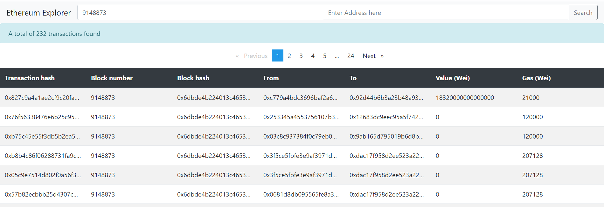

# Ethereum Explorer

The application allows users to search an Ethereum block for all the transactions associated with a block or an address and return the results of the transaction.

Try out the app deployed in Heroku at https://stackpond-ethereum-explorer.herokuapp.com/

## Development

### Development server

Run `ng serve` for a dev server. Navigate to `http://localhost:4200/`. The app will automatically reload if you change any of the source files.

### Build

Run `ng build` to build the project. The build artifacts will be stored in the `dist/` directory. Use the `--prod` flag for a production build.

### Running unit tests

Run `ng test` to execute the unit tests via [Karma](https://karma-runner.github.io).

### Running end-to-end tests

Run `ng e2e` to execute the end-to-end tests via [Protractor](http://www.protractortest.org/).

### Code scaffolding

Run `ng generate component component-name` to generate a new component. You can also use `ng generate directive|pipe|service|class|guard|interface|enum|module`.

## Usage

The following screen shows the dashboard.

The following screen shows the transactions for a given block number.

## Important notes

For local testing of the app, run the local version of API (refer Ethereum API at https://github.com/stackpond/ethereum-api for setup details).

The transaction results are paged for better user experience.

The app uses back end api (refer my another project Ethereum API at https://github.com/stackpond/ethereum-api which in turn uses Infura API (refer https://infura.io/docs/ethereum)

Infura API has rate limit imposed (refer https://infura.io/pricing) which may also slow down the processing.

The search by address is especially slow because Infura API does not provide any API for this use. Hence every transactions of every block needs to be processed and it can a very long time before the results are fetched. I have few ideas to speed this up by creating an indexer service separate from core API which can then be consumed for faster processing. This is TBD.
